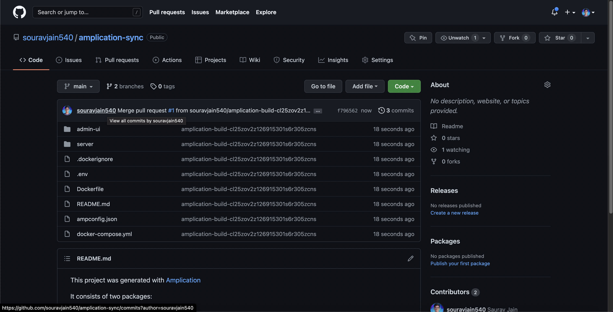

# Sync with GitHub

Amplication can push the code of your app to a GitHub repository. It will provide you with full control on your app, and will also allow you to easily track the changes and the code generated by Amplication.

## General

- For every commit you create in Amplication, it will push a new Pull Request to your GitHub repository with the updated code.
- You will always have the choice to decide how and if to merge the changes to your branch.
- The pull request will be created in a new branch, with the default branch of your repository (usually **master** or **main**) as a base.
- The code from Amplication will be created relatively to the root of the selected repository.
- The selected repository must not be empty, so please create at least one file in the root folder.

If you want to create a new repository in GitHub, you can do so [here](https://github.com/new). Please select **Initialize this repository with a README file** to make sure the new repository is not empty.

:::info
If you are using the hosted service on https://app.amplication.com, you can continue with this guide.

In case you are hosting a local Amplication server, you should first follow [this guide](/docs/connect-server-to-github) in order to configure the Server to work with a new GitHub application.
:::

## Authorize Amplication to access your GitHub account

Before integrating your application with GitHub, you need to authorize Amplication to get access to your GitHub account.

1. Click the **Dashboard** icon in the main menu.
2. Click the **Sync with GitHub** tab to reach the settings page.
3. click the **Sync with GitHub** Toggle button to start the authorization process.
4. In the new window, accept the request to allow Amplication to access your GitHub account.

## Select the GitHub repository to use

After completing the authorization process, you need to select the GitHub repository to use in the integration.

1. Select your organization/account from github
2. Click on the **Select Repository** button.
3. Select the repository you want to use.

## Create a new Pull Request in GitHub

Amplication will automatically push a new Pull Request to your GitHub repository, every time you commit your changes.

To test the process, just make a change in your application and commit it.

In the **Last Commit** section click on **Open GitHub** to view the new Pull Request in GitHub.

You can now view the code changes generated by Amplication, and merge the changes.

## Learn more

- [How to add custom code to your application](/docs/how-to/custom-code)
